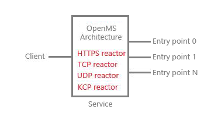

<pre>
  ___                   __  __ ____  
 / _ \ _ __   ___ _ __ |  \/  / ___| 
| | | | '_ \ / _ \ '_ \| |\/| \___ \ 
| |_| | |_) |  __/ | | | |  | |___) |
 \___/| .__/ \___|_| |_|_|  |_|____/ 
======|_|============================

:: OpenMS ::                (v1.0.0)
</pre>

## Description
The Distributed Network Framework based on Microservice Theory.

## Features
- [x] Support reactor network model
- [x] Support tcp, udp, kcp, rpc, http
- [x] Support Cpp20 coroutine coding
- [x] Support Erlang-style message
- [x] Support microservice cluster
- [x] Support Windows, macOS, Linux
- [ ] Support Hot module replacement

## How to install
* Set the environment variable "VCPKG_ROOT_CUSTOM".
* Use [vcpkg](https://learn.microsoft.com/zh-cn/vcpkg/get_started/overview) to install dependency on manifest mode.
* Use Clion or Visual studio to open CMakeLists.txt.
* See directory "Sample" for more details.

## Architecture

